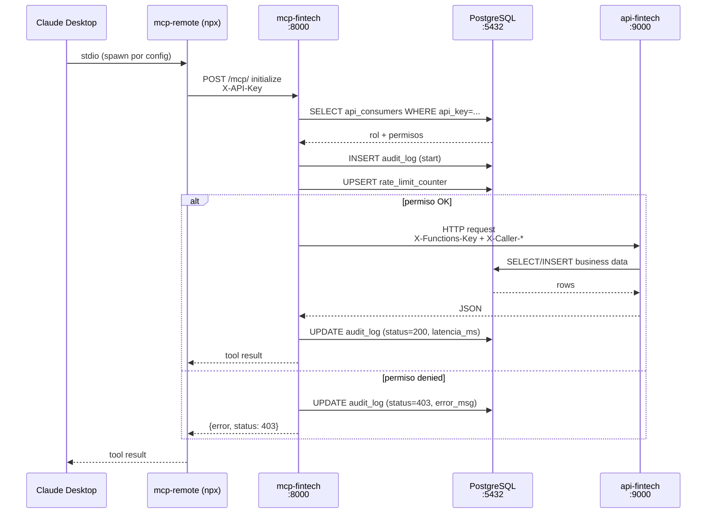
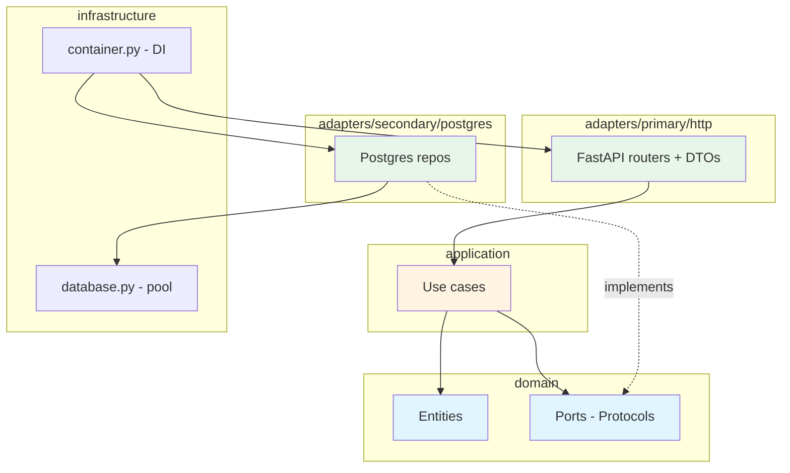

# Fintech MCP Simulation

Simulación de arquitectura MCP bancaria con autenticación por roles, rate limiting y auditoría persistida en PostgreSQL.

Backend implementado con **Clean Architecture + Hexagonal (Ports & Adapters)** sobre FastAPI, exponiendo **16 tools** (13 de negocio + 3 variantes HTML server-rendered para contraste con Artifacts del LLM) y **6 prompts** MCP a través de FastMCP con transporte `streamable-http`. Los prompts orquestan tool calls + render visual (Artifacts React, diagramas Mermaid).

## Diagrama de flujo



## Arquitectura de código (`api-fintech`)



> **Regla de dependencia:** las flechas siempre apuntan hacia adentro (`adapters → application → domain`). Ver [ADR-0001](docs/adr/0001-clean-hexagonal-architecture.md).

## Stack (3 contenedores)

| Contenedor   | Puerto | Rol |
|-------------|--------|-----|
| postgres    | 5432   | Auth, auditoría, rate limiting + datos bancarios |
| api-fintech | 9000   | Endpoints bancarios (FastAPI + Clean Architecture) |
| mcp-fintech | 8000   | 16 MCP tools + 6 prompts (FastMCP `streamable-http`) |

## Arquitectura `api-fintech`

```
api-fintech/
├── domain/              # Entidades + ports (Pydantic + Protocol)
│   ├── entities/
│   ├── ports/
│   └── exceptions.py
├── application/         # Casos de uso (lógica de negocio pura)
│   └── use_cases/
├── adapters/
│   ├── primary/http/    # Routers FastAPI + DTOs de request
│   └── secondary/postgres/  # Repositorios PostgreSQL
└── infrastructure/      # Pool de BD, container de DI, lifespan
```

La regla de dependencia es estricta: **adapters → application → domain**. Cambiar de PostgreSQL a otra fuente solo requiere reemplazar los adapters secundarios en `container.py`.

## Setup

```bash
cp .env.example .env
docker compose up --build
```

Verificar que los 3 contenedores estén `healthy`:

```bash
docker compose ps
```

## Usuarios de prueba

| API Key | Rol | Permisos |
|---------|-----|---------|
| `usr-maria-garcia-a3f9k2` | user  | `cuentas:read`, `gastos:read` |
| `adm-fintech-x9p2m7k1`   | admin | todo + `cuentas:write` (auditoría) |

Rate limit: 100 llamadas/hora por consumer.

## Datos seed

- Clientes: `cliente-001`, `cliente-002`, `cliente-003`
- Cuentas: `CTA-001` … `CTA-006`
- Transferencias: `TRF-001` … `TRF-004`
- 27 movimientos, 8 presupuestos, 11 categorías de gasto

## 16 MCP tools

| Tool | Permiso | Notas |
|------|---------|-------|
| `fintech_consultar_cuentas`        | `cuentas:read` | JSON |
| `fintech_consultar_cuentas_html`   | `cuentas:read` | **HTML server-rendered** (contraste con artifact del LLM) |
| `fintech_ver_saldo`                | `cuentas:read` | |
| `fintech_ver_movimientos`          | `cuentas:read` | |
| `fintech_crear_cuenta`             | `cuentas:write` | |
| `fintech_realizar_transferencia`   | `transferencias:write` | |
| `fintech_estado_transferencia`     | `transferencias:read` | |
| `fintech_historial_transferencias` | `transferencias:read` | |
| `fintech_consultar_limites`        | `transferencias:read` | |
| `fintech_resumen_gastos`           | `gastos:read` | JSON |
| `fintech_resumen_gastos_html`      | `gastos:read` | **HTML server-rendered** |
| `fintech_detalle_categorias`       | `gastos:read` | |
| `fintech_establecer_presupuesto`   | `gastos:write` | |
| `fintech_ver_alertas`              | `gastos:read` | |
| `fintech_ver_auditoria`            | `cuentas:write` (admin) | JSON |
| `fintech_ver_auditoria_html`       | `cuentas:write` (admin) | **HTML server-rendered** |

## 6 MCP prompts (plantillas pre-armadas con artifacts)

Los prompts aparecen en Claude Desktop como un menú (icono `+` o slash). Inyectan instrucciones que orquestan tool calls + indican a Claude cómo renderizar el output (artifact React, diagrama Mermaid).

| Prompt | Argumentos | Render |
|--------|-----------|--------|
| `resumen_cliente`        | `cliente_id` | Artifact React (dashboard ejecutivo) |
| `flujo_transferencias`   | `cuenta_id`  | Diagrama Mermaid `graph LR` |
| `alerta_presupuesto`     | `cliente_id` | Artifact React (BarChart Recharts) |
| `comparar_clientes`      | `cliente_a`, `cliente_b` | Artifact React side-by-side + veredicto |
| `auditoria_postmortem`   | `limite` *(default 30)* | Artifact React (admin only) |
| `replay_auditoria`       | `limite` *(default 8)* | Sequence diagram Mermaid (admin only) |

### Comparación: dos enfoques de render

El demo expone **3 pares** de tool JSON / variante HTML para que veas el mismo dato resuelto con dos tecnologías de presentación distintas:

| Caso de uso | Tool JSON (input para LLM) | Tool HTML (server-rendered) | Prompt MCP equivalente |
|-------------|---------------------------|-----------------------------|------------------------|
| Resumen de gastos | `fintech_resumen_gastos` | `fintech_resumen_gastos_html` | `alerta_presupuesto` |
| Cuentas de un cliente | `fintech_consultar_cuentas` | `fintech_consultar_cuentas_html` | `resumen_cliente` |
| Auditoría (admin) | `fintech_ver_auditoria` | `fintech_ver_auditoria_html` | `auditoria_postmortem` |

| Approach | Renderiza | Ventaja | Cuándo elegirlo |
|----------|-----------|---------|-----------------|
| **Server-side HTML** | Python + CSS inline | Determinista, idéntico siempre, exportable | Reportes formales, emails a auditores, snapshots regulatorios |
| **LLM Artifacts (React)** | Claude → Recharts | Interactivo, customizable, hover/tooltip | Dashboards exploratorios, análisis ad-hoc |

## Conectar a Claude Desktop

### 0. Pre-flight

```bash
node --version              # Node 18+
docker compose ps           # los 3 contenedores en (healthy)
curl http://localhost:8000/health
# {"status":"ok","service":"mcp-fintech","tools":13}
```

### 1. Editar el config

**macOS:** `~/Library/Application Support/Claude/claude_desktop_config.json`

```bash
mkdir -p ~/Library/Application\ Support/Claude
touch ~/Library/Application\ Support/Claude/claude_desktop_config.json
open -e ~/Library/Application\ Support/Claude/claude_desktop_config.json
```

Si TextEdit te ofrece guardar como Rich Text, convertilo a Plain Text con **Format → Make Plain Text** (`Cmd+Shift+T`).

### 2. Pegar el bloque `mcpServers`

⚠️ **Importante**: en versiones recientes de Claude Desktop, este archivo puede ya tener una sección `"preferences"`. NO la borres — agregá `"mcpServers"` al lado:

```json
{
  "preferences": {
    "coworkWebSearchEnabled": true,
    "sidebarMode": "task",
    "coworkScheduledTasksEnabled": true,
    "ccdScheduledTasksEnabled": true
  },
  "mcpServers": {
    "fintech": {
      "command": "npx",
      "args": [
        "-y",
        "mcp-remote",
        "http://localhost:8000/mcp",
        "--header",
        "X-API-Key:usr-maria-garcia-a3f9k2"
      ]
    }
  }
}
```

Si tu archivo está vacío, dejá solo el bloque `"mcpServers"` envuelto en un objeto raíz.

Guardá con `Cmd+S`.

### 3. Reiniciar Claude Desktop completo

```bash
osascript -e 'quit app "Claude"'
sleep 2
open -a "Claude"
```

> Cerrar la ventana NO basta — Claude Desktop solo relee el config con un quit completo (`Cmd+Q`).

### 4. Verificar que cargó

En una conversación nueva, hacé click en el icono **🔨** (o "Search and tools") debajo del input. Deberías ver **"fintech"** con 16 tools (los 6 prompts pueden no aparecer en la UI según la versión — eso no impide su uso, ver `docs/pruebas/`).

Si no aparece, revisá los logs:

```bash
tail -50 ~/Library/Logs/Claude/mcp-server-fintech.log
```

### 5. Cambiar de user a admin

Editá el JSON cambiando solo el valor del header:

```diff
-"X-API-Key:usr-maria-garcia-a3f9k2"
+"X-API-Key:adm-fintech-x9p2m7k1"
```

`Cmd+Q` Claude Desktop y reabrirlo.

### Alternativa: UI de Connectors (Claude Desktop reciente)

Versiones nuevas de Claude Desktop ofrecen una UI para agregar MCP servers sin tocar JSON:

- **Name:** `fintech`
- **URL:** `http://localhost:8000/mcp`

Funciona si la UI permite **headers personalizados** (necesitás agregar `X-API-Key`). Si solo ofrece OAuth o exige HTTPS, usá el método del JSON.

---

## Prompts de prueba

### Como **usuario normal** (`usr-maria-garcia-a3f9k2`)

**Lecturas básicas:**
- "¿Cuáles son las cuentas del cliente-001?" → `fintech_consultar_cuentas`
- "¿Cuánto tiene en CTA-001?" → `fintech_ver_saldo`
- "Muéstrame los últimos 5 movimientos de CTA-004" → `fintech_ver_movimientos`

**Encadenamiento de tools:**
- "Comparame el saldo de CTA-001 con CTA-002 y decime cuál tiene más" → llama `fintech_ver_saldo` 2 veces
- "Dame un resumen del cliente-001: cuentas, movimientos recientes y alertas de gasto"

**Gastos / presupuesto:**
- "¿En qué gastó más este mes el cliente-001?" → `fintech_resumen_gastos`
- "Mostrame el desglose por categoría con los presupuestos del cliente-002" → `fintech_detalle_categorias`
- "¿El cliente-003 está excediendo algún presupuesto?" → `fintech_ver_alertas`

**Transferencias (lectura):**
- "¿Cuál fue el último movimiento de CTA-001?" → `fintech_historial_transferencias`
- "¿Qué pasó con la transferencia TRF-001?" → `fintech_estado_transferencia`
- "¿Cuánto puede transferir hoy el cliente-001?" → `fintech_consultar_limites`

**Esperan 403 (sin permiso de escritura):**
- "Realiza una transferencia de 100 soles de CTA-001 a CTA-003" → 403 con `transferencias:write`
- "Crea una cuenta nueva de ahorros para cliente-002" → 403 con `cuentas:write`
- "Establece un presupuesto de 600 soles para Salud del cliente-001" → 403 con `gastos:write`
- "Mostrame la auditoría del sistema" → 403 (solo admin)

### Como **admin** (`adm-fintech-x9p2m7k1`)

**Operaciones de escritura:**
- "Realiza una transferencia de 500 soles de CTA-001 a CTA-003 con descripción 'pago alquiler'"
- "Crea una cuenta corriente en USD para cliente-002"
- "Establece presupuesto de 800 soles para Alimentación del cliente-001"

**Auditoría y gobernanza:**
- "Mostrame la auditoría del sistema, últimos 10 registros" → `fintech_ver_auditoria`
- "¿Hubo intentos de acceso bloqueados hoy?" → debería filtrar los 403 del audit
- "¿Qué tools usó María García?" → admin puede ver actividad de otros consumers
- "¿Cuál fue el tool con peor latencia en las últimas 20 llamadas?"

**Análisis multi-tool (encadenamiento real):**
- "Dame un resumen financiero completo del cliente-001: saldos totales, transferencias del mes, alertas de gasto y disponibilidad para transferir"
  → encadena `fintech_consultar_cuentas` + `fintech_historial_transferencias` × N + `fintech_ver_alertas` + `fintech_consultar_limites`
- "Compará el comportamiento de gasto entre cliente-001 y cliente-002"
- "Si quisiera transferir 800 soles de CTA-001 a CTA-003, ¿es posible? Verificá saldo, límite diario disponible y ejecutá si todo OK"

### Verificación cruzada en BD

Después de cualquier prompt, podés ver el rastro:

```bash
make audit-log
```

Cada llamada (200, 403, 502) debería aparecer con consumer, tool, params, status, latencia y error (si falló).

## Auditoría en PostgreSQL

```bash
docker exec fintech-postgres psql -U fintech -d fintechdb -c "
SELECT ac.nombre, al.tool_nombre, al.status_code, al.latencia_ms, al.llamado_en::text
FROM audit_log al JOIN api_consumers ac ON al.consumer_id = ac.id
ORDER BY al.llamado_en DESC LIMIT 20;"
```

Cada llamada queda registrada con: consumer, tool, parámetros, status code, latencia y mensaje de error (si falló).

## Comandos útiles

```bash
docker compose ps                    # estado de contenedores
docker compose logs -f mcp-fintech   # logs del servidor MCP
docker compose logs -f api-fintech   # logs de la API
docker compose restart mcp-fintech   # reiniciar MCP
docker compose down -v               # reset completo (borra volumen de PostgreSQL)
```

## Endpoints HTTP directos (sin MCP)

Para testear la API sin pasar por el MCP:

```bash
curl -H "X-Functions-Key: fintech-func-key-2024" \
     http://localhost:9000/api/cuentas/cliente-001
```

## Versiones

- Python 3.12, FastAPI 0.111, asyncpg 0.29
- `mcp[cli]` 1.9.4 (transporte `streamable-http`)
- PostgreSQL 16 (alpine)

## Documentación interna

- [`docs/adr/`](docs/adr/) — decisiones arquitectónicas (Clean+Hex, streamable-http, Protocol ports, lifespan retry).
- [`docs/pruebas/`](docs/pruebas/) — bitácora de pruebas end-to-end en Claude Desktop con capturas de pantalla.
- [`SECURITY.md`](SECURITY.md) — modelo de amenazas y notas de seguridad del demo.
- [`CONTRIBUTING.md`](CONTRIBUTING.md) — workflow de desarrollo, tests, pre-commit.
- [`CHANGELOG.md`](CHANGELOG.md) — historial de cambios.

## Tests

```bash
make install         # crea .venv y instala deps de dev
make test-unit       # 32 unit tests, ~0.4s, sin docker
make test-integration  # tests con testcontainers postgres (requiere docker + Python 3.12)
make test-security   # E2E security tests contra el stack levantado
make audit           # bandit + pip-audit
make lint            # ruff check
```

CI corre todos los anteriores en cada push a `main` o pull request — ver [`.github/workflows/ci.yml`](.github/workflows/ci.yml).

## Roadmap (siguientes pasos hacia producción)

Fuera del scope del demo, pero documentado para referencia:

- TLS terminado en Traefik/Caddy delante de los servicios.
- Hash de API keys en BD (argon2) en vez de plaintext.
- Rate limit distribuido con Redis para escalar a múltiples réplicas.
- OpenTelemetry traces + métricas Prometheus + dashboard Grafana.
- Migraciones con Alembic en vez de `init.sql` manual.
- Secret manager (Vault, AWS SM) en vez de `.env`.
- SBOM generado en CI (`syft`).
