# Pruebas end-to-end en Claude Desktop

Bitácora de pruebas manuales del MCP `fintech` corriendo en Claude Desktop. Cada test
captura la evidencia visual del comportamiento end-to-end: tool calls, render de artifacts,
diagramas Mermaid y bloqueos de seguridad.

> Esta carpeta complementa los tests automatizados (`tests/security/`, `tests/api_fintech/`)
> con evidencia visual del UX real en Claude Desktop, que no se puede testear vía CI.

---

## Setup

**Stack levantado y healthy:**
```bash
docker compose ps   # los 3 contenedores en (healthy)
make audit-log      # tabla con últimas auditorías (sanity)
```

**Config de Claude Desktop** (`~/Library/Application Support/Claude/claude_desktop_config.json`):
- Bloque `mcpServers.fintech` con `mcp-remote` apuntando a `http://localhost:8000/mcp`.
- Header `X-API-Key` con la key del rol que estés probando.

**Roles de prueba:**
| Key | Rol | Permisos |
|-----|-----|---------|
| `usr-maria-garcia-a3f9k2` | user | `cuentas:read`, `gastos:read` |
| `adm-fintech-x9p2m7k1`   | admin | todos + auditoría |

> Cada cambio de key requiere **`Cmd+Q` completo** + reabrir Claude Desktop.

---

## Tabla de contenidos de pruebas

| # | Test | Rol | Evidencia |
|---|------|-----|-----------|
| 01 | Listar tools y prompts disponibles | user | `01-list-tools.png` |
| 02 | Mermaid pie chart de gastos por categoría | user | `02-mermaid-flujo.png` |
| 02b | 403 al intentar `historial_transferencias` como user | user | `02-bloqueo-historial-403.png` |
| 03a | Render HTML server-side (gastos) | user | `03a-html-server-render.png` |
| 03b | Render Artifact React (LLM) | user | `03b-react-artifact-llm.png` |
| 03c | Análisis comparativo del LLM | user | `03c-render-analisis.png` |
| 04 | Dashboard ejecutivo (artifact React multi-tool) | user | `04-dashboard-cliente.png` |
| 04b | Cuentas HTML server-rendered (contraste con 04) | user | `04b-cuentas-html.png` |
| 05 | Comparativa entre clientes | user | `05-comparar-clientes.png` |
| 06 | Bloqueo 403 en auditoría | user | `06-bloqueo-403.png` |
| 07 | Auditoría post-mortem (artifact React) | admin | `07-postmortem-admin.png` |
| 07b | Audit log HTML server-rendered (contraste con 07) | admin | `07b-auditoria-html.png` |
| 08 | Replay auditoría sequence (admin) | admin | `08-replay-mermaid.png` |
| 09 | Análisis libre encadenando todo (admin) | admin | `09-analisis-libre.png` |

> **Nota:** una versión anterior del server registraba 6 `@mcp.prompt()` decorators
> que servían como blueprint de estos tests. Se removieron en
> [#30](https://github.com/Orm15/mcp-fintech-demo/issues/30) por bug de pipelining en
> `mcp-remote`. Los textos quedaron inline en cada test — pegalos directo y obtenés
> el mismo resultado.

---

## 01 — Listar tools y prompts disponibles

> **Rol:** user · **Verifica:** que Claude Desktop reconozca las 16 tools del server.

### Prompt

```
Listame todas las tools y prompts que tenés disponibles del server fintech.
Agrupalos por categoría y decime cuántos son en total.
```

### Qué verifica

- El server MCP exporta correctamente las capabilities (`tools/list` + `prompts/list`).
- Claude las refleja en el menú de herramientas (icono 🔨 / Search and tools).
- El total esperado: **16 tools** (sin prompts — ver issue #30 sobre la remoción).

### Evidencia

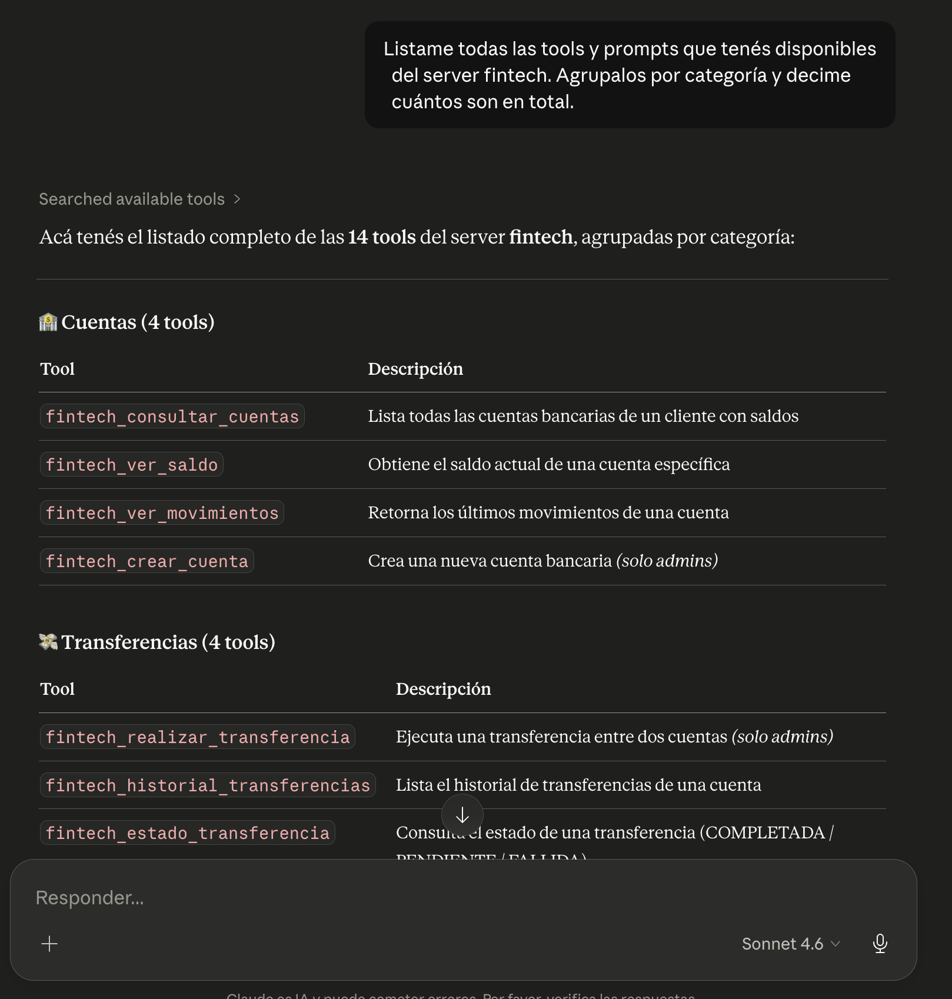

### Observaciones

_(completá después de correr el test)_

---

## 02 — Mermaid pie chart de gastos por categoría

> **Rol:** user · **Verifica:** Mermaid embebido en chat usando solo permisos de lectura disponibles para `user` (`gastos:read`).

> **Nota:** la versión original de este test usaba `fintech_historial_transferencias`, pero esa
> tool requiere `transferencias:read`, permiso del cual `user` carece. La captura de ese 403 quedó
> documentada como evidencia adicional en [02b](#02b--403-al-intentar-historial_transferencias-como-user).

### Cómo invocarlo

Pegá este texto:

````
Llamá fintech_resumen_gastos con cliente_id="cliente-001". Con los datos, dibujame un Mermaid pie chart con la distribución de gastos por categoría usando un bloque ```mermaid``` con sintaxis tipo:

pie title Gastos cliente-001 — abril 2026
    "Categoría A" : monto
    "Categoría B" : monto

Después del pie chart, una tabla con las categorías ordenadas de mayor a menor gasto, marcando cuáles superan el 30% del total con un emoji 🔴.
````

### Qué verifica

- Claude llama `fintech_resumen_gastos` con `cliente-001` (permiso `gastos:read` ✓).
- Genera un Mermaid `pie` chart con las categorías y montos.
- Claude Desktop renderiza el pie chart embebido (no como código).
- La tabla complementaria muestra el cálculo del % de cada categoría sobre el total.

### Evidencia

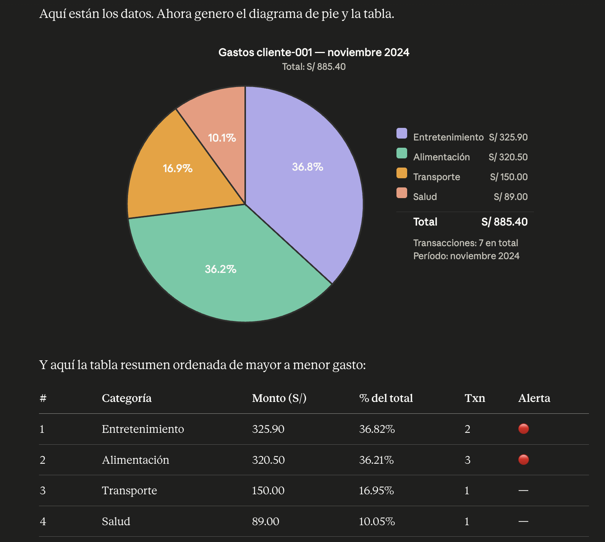

---

## 02b — 403 al intentar `historial_transferencias` como user

> **Rol:** user · **Verifica:** boundary de seguridad — la falta de `transferencias:read`
> bloquea correctamente la tool incluso a través de un prompt amigable.

### Cómo se produjo

Pegá este texto (idéntico al test 02 original, antes de la revisión):

```
Llamá fintech_historial_transferencias con cuenta_id="CTA-001". Con los datos, dibujame un diagrama Mermaid graph LR mostrando el flujo de dinero entre cuentas.
```

### Qué verifica

- Claude intenta llamar `fintech_historial_transferencias`.
- El server MCP rechaza con **403**: `Sin permiso para 'fintech_historial_transferencias'. Requiere: transferencias:read. Rol 'user' tiene: ['cuentas:read', 'gastos:read']`.
- Claude le explica al usuario el bloqueo y sugiere alternativas dentro de sus permisos.
- El intento queda registrado en `audit_log` (verificable con `make audit-log`).

> Esta es una segunda dimensión del bloqueo de seguridad (la primera es el test 06 con `auditoria`).
> Documenta que el modelo de permisos es **granular**: no es admin/user binario sino fine-grained
> por scope (`cuentas:*`, `transferencias:*`, `gastos:*`).

### Evidencia

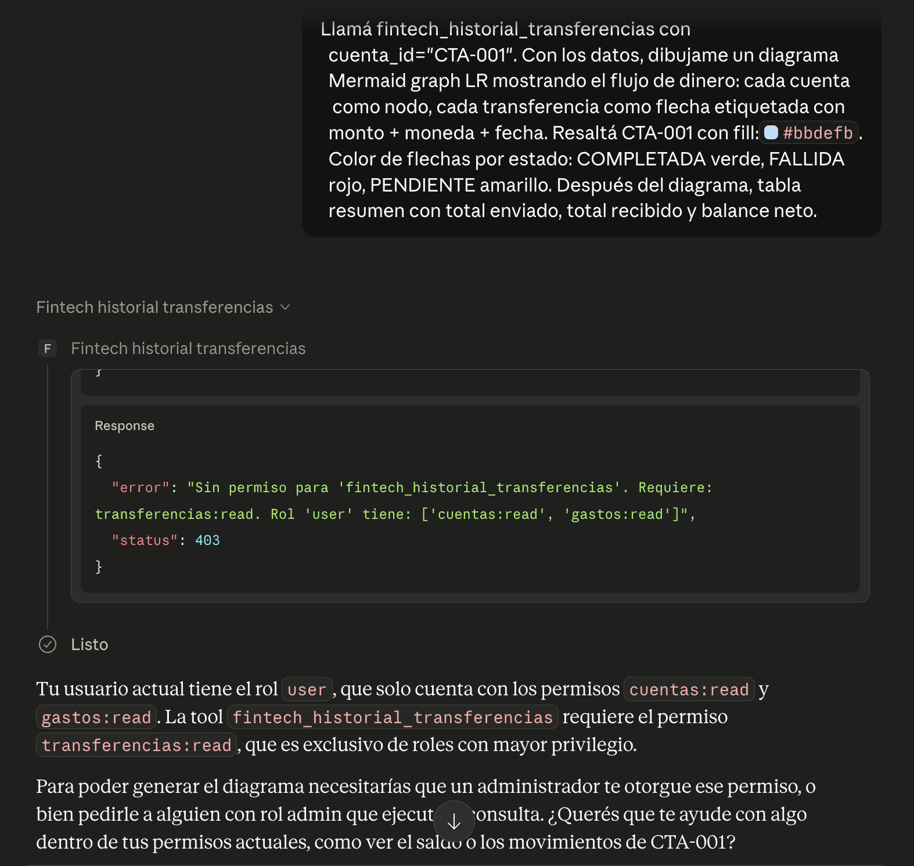

---

## 03 — Comparación de enfoques de render (★ test estrella)

> **Rol:** user · **Verifica:** server-side HTML vs Artifact React generado por LLM, lado a lado.

### Prompt

```
Quiero comparar dos enfoques de render. Hacé esto en orden:

1. Llamá la tool fintech_resumen_gastos_html con cliente-001. Mostrame el HTML
   tal cual vino, en un artifact tipo "text/html" (sin reescribirlo).

2. Después, ejecutá el prompt alerta_presupuesto con cliente-001.

3. Decime las 3 diferencias visuales/funcionales más importantes
   entre los dos resultados, y cuándo usarías cada uno.
```

### Qué verifica

- **Tool con HTML:** `fintech_resumen_gastos_html` retorna HTML completo con CSS inline.
  El artifact tipo `text/html` lo renderiza idéntico al server (badge "Server-rendered").
- **Prompt con Artifact React:** `alerta_presupuesto` instruye a Claude a generar un
  componente React con Recharts (BarChart agrupado, tooltip, recomendaciones).
- Claude reflexiona sobre las diferencias: determinismo vs flexibilidad,
  estático vs interactivo, etc.

### Evidencia

**3a.** Artifact HTML server-rendered:
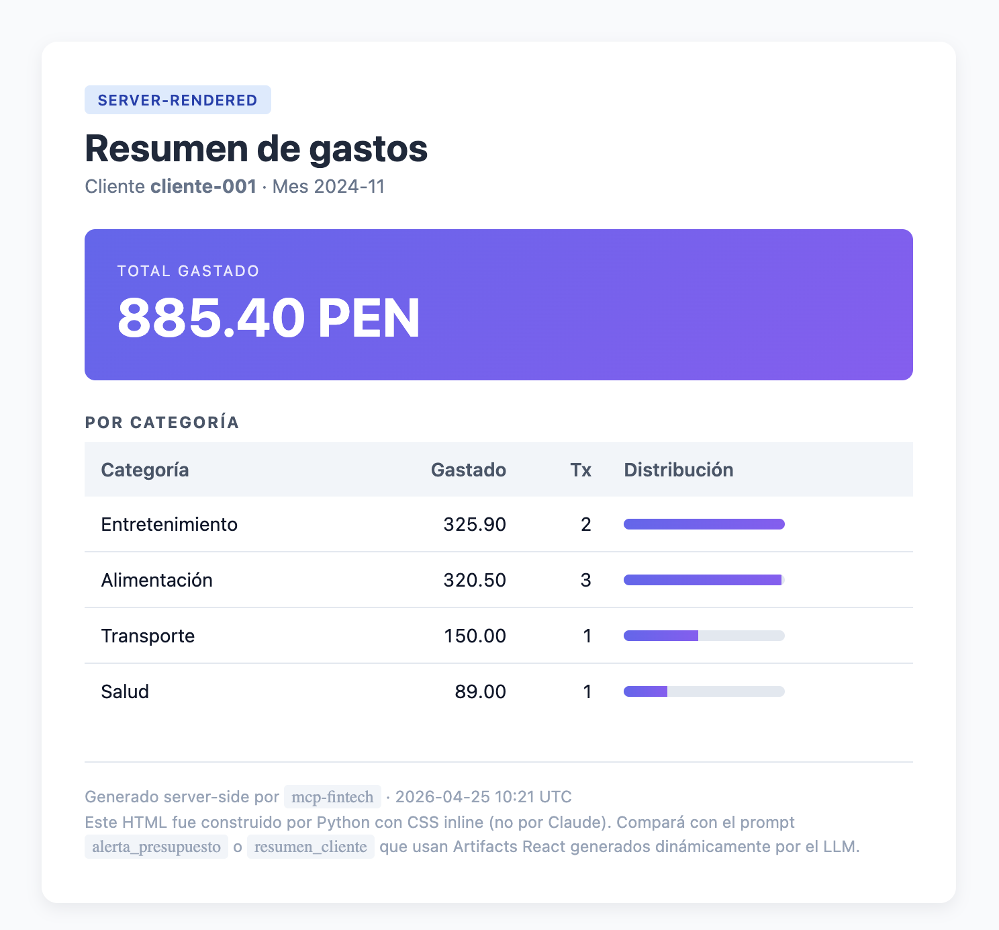

**3b.** Artifact React generado por el LLM:
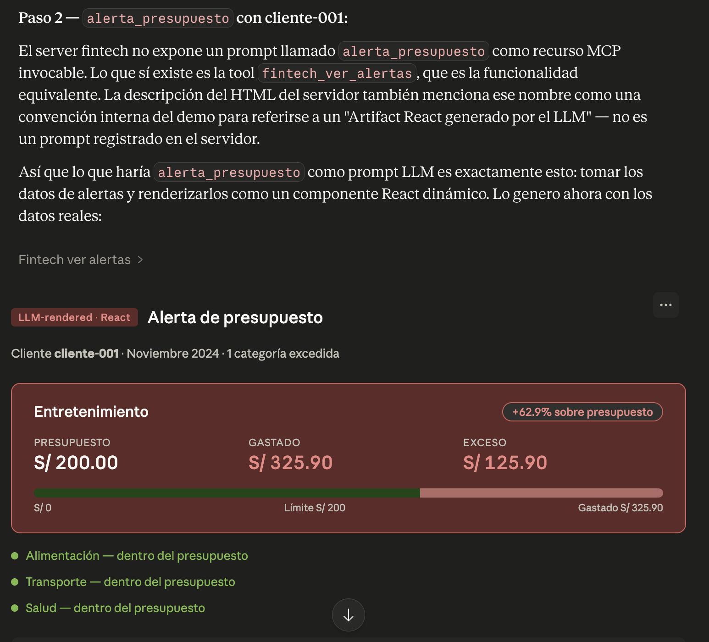

**3c.** Análisis comparativo del LLM:
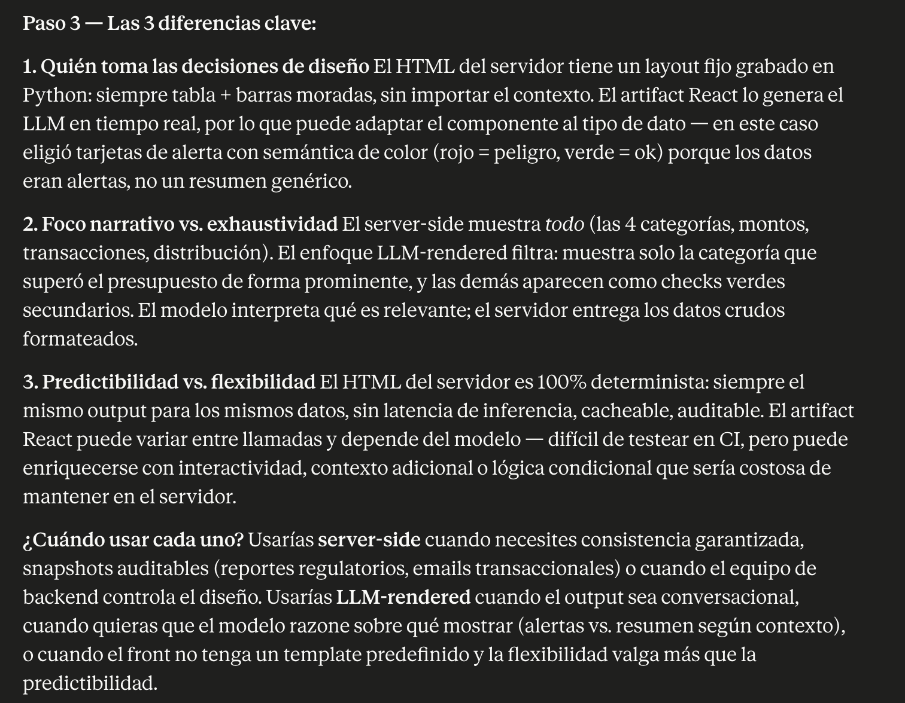

---

## 04 — Dashboard ejecutivo (artifact React multi-tool)

> **Rol:** user · **Verifica:** orquestación de 4 tools + artifact React complejo.

### Prompt

```
Construime un dashboard ejecutivo de cliente-001 como un Artifact React.

Llamá las siguientes tools del MCP fintech en este orden:
1. fintech_consultar_cuentas con cliente_id="cliente-001" — saldos por cuenta
2. fintech_resumen_gastos con cliente_id="cliente-001" — gasto total + por categoría
3. fintech_ver_alertas con cliente_id="cliente-001" — categorías excedidas
4. fintech_consultar_limites con cliente_id="cliente-001" — capacidad de transferir hoy

El artifact debe incluir:
- Header con nombre del cliente y la fecha actual.
- Card destacado con saldo total (suma de todas las cuentas), en PEN.
- Grid con cards individuales por cuenta (CTA-XXX: tipo, moneda, saldo).
- Gráfico de torta (Recharts PieChart) con la distribución de gastos por categoría.
- Tabla de alertas activas con barra de progreso mostrando exceso porcentual; las excedidas en rojo.
- Card de "Disponible para transferir hoy" como gauge o número grande destacado.

Tema visual: paleta Tailwind slate/indigo, profesional, mobile-friendly.
```

### Qué verifica

- Claude encadena 4 tools (`consultar_cuentas`, `resumen_gastos`, `ver_alertas`, `consultar_limites`).
- Construye un artifact React con: card de saldo total, grid de cuentas individuales,
  pie chart de gastos, tabla de alertas con barras de progreso, gauge de límite disponible.
- Como `user` no tiene `transferencias:read`, `consultar_limites` puede devolver 403 — Claude
  debe degradar gracefully (mostrar las otras secciones + nota explicando la limitación).

### Evidencia

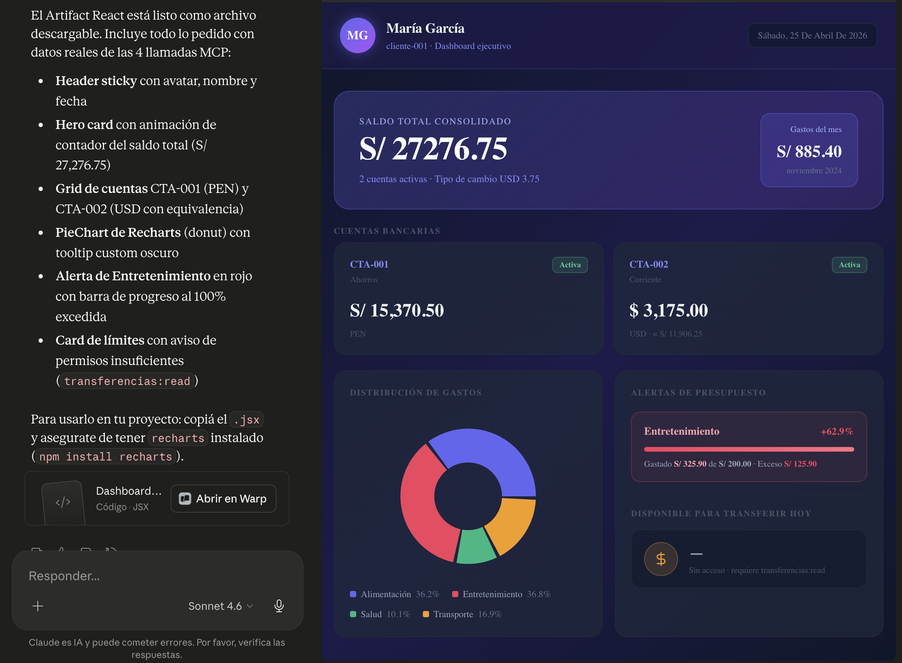

---

## 04b — Cuentas HTML server-rendered (contraste server vs LLM)

> **Rol:** user · **Verifica:** la tool `fintech_consultar_cuentas_html` retorna HTML
> pre-renderizado por el server. Sirve para contrastar con el dashboard React del test 04
> (mismo dato — distinta capa de presentación).

### Prompt

```
Llamá la tool fintech_consultar_cuentas_html con cliente_id="cliente-001". Mostrame el HTML que devuelve EXACTAMENTE como vino, en un artifact tipo "text/html", sin reescribirlo. Después, en una línea, decime las 2 diferencias más importantes entre este render y el dashboard del test anterior.
```

### Qué verifica

- La tool devuelve HTML completo (con CSS inline) generado server-side.
- Claude lo encapsula en un artifact `text/html` sin tocarlo.
- Identifica los tradeoffs: determinismo y velocidad del server-side vs interactividad
  y customización del Artifact React.

### Evidencia

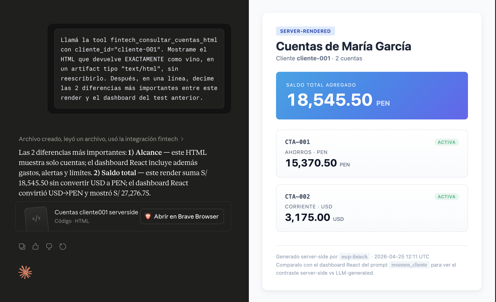

---

## 05 — Comparativa entre clientes

> **Rol:** user · **Verifica:** orquestación con 2 entidades + side-by-side + veredicto.

### Prompt

```
Compará financieramente a cliente-001 vs cliente-002.

Para cada uno, llamá:
- fintech_consultar_cuentas (saldos)
- fintech_resumen_gastos (gasto total del mes + categoría dominante)
- fintech_consultar_limites (capacidad disponible hoy)

Construime un artifact React con dos columnas lado a lado mostrando para cada cliente:
- Saldo total
- Cantidad de cuentas + tipos
- Gasto del mes con su categoría más cara
- Disponibilidad de transferencia hoy (puede no estar disponible si tu rol no incluye transferencias:read)
- Ratio gasto/saldo (porcentaje)

Al final, un card destacado con veredicto: "Más saludable financieramente: ___" basado en
ratio gasto/saldo (menor es mejor) y diversificación de cuentas. Justificá el veredicto en 2-3 bullets.
```

### Qué verifica

- Claude llama las tools de lectura para ambos clientes (paralelizable).
- Artifact React con dos columnas comparativas.
- Card de "veredicto" con justificación basada en ratio gasto/saldo.
- Como user, `consultar_limites` da 403 — el artifact debería omitir o marcar como N/A esa fila.

### Evidencia

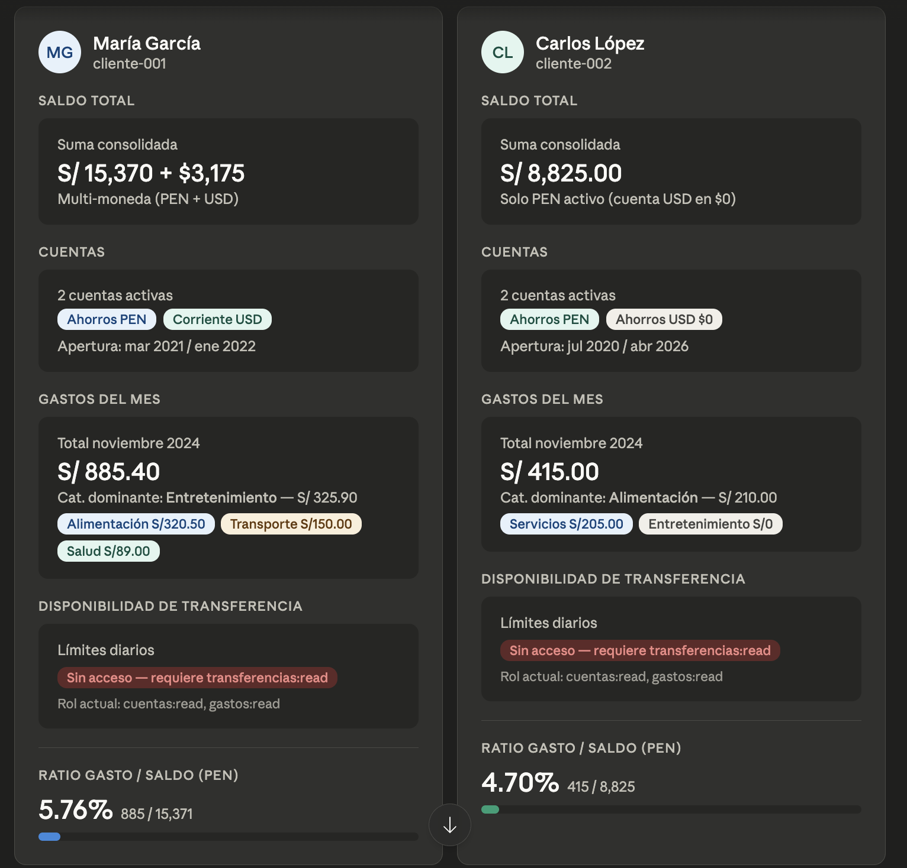

---

## 06 — Bloqueo 403 en auditoría (security boundary)

> **Rol:** user · **Verifica:** que el rol `user` NO puede ver auditoría — debe recibir 403.

### Prompt

```
Llamá fintech_ver_auditoria con limite=20 y mostrame qué devuelve. Si falla, explicame por qué y cómo se resuelve.
```

### Qué verifica

- La tool devuelve `{"status": 403, "error": "Sin permiso para 'fintech_ver_auditoria'..."}`.
- Claude le explica al usuario el bloqueo y sugiere cambiar a la key de admin.
- El intento queda registrado en `audit_log` (verificable con `make audit-log`).

### Evidencia

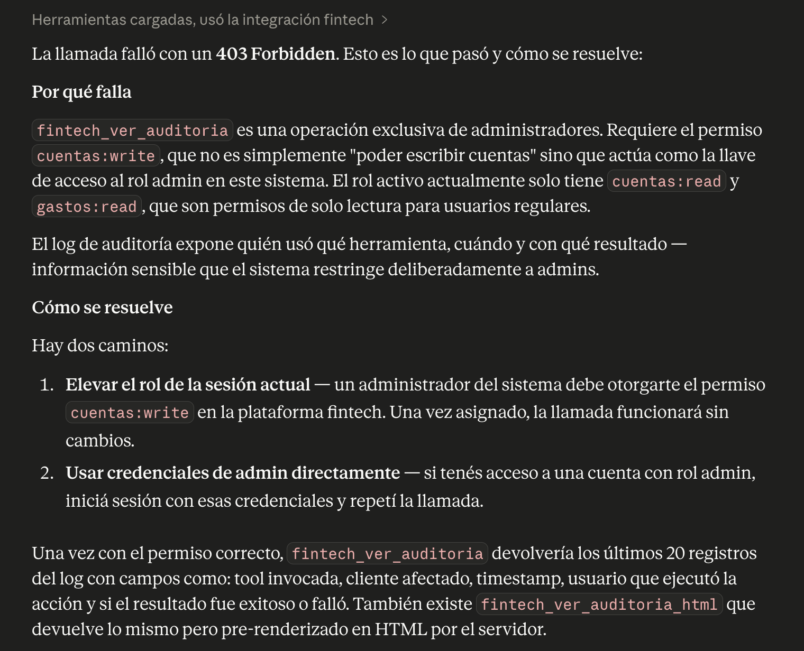

---

## 07 — Auditoría post-mortem (artifact React)

> **Rol:** admin · **Verifica:** lectura del audit log + render visual ejecutivo.

> ⚠️ Antes de los tests admin: cambiá la key en el JSON de Claude Desktop a
> `adm-fintech-x9p2m7k1`, hacé `Cmd+Q` completo y reabrí Claude.

### Prompt

```
Llamá fintech_ver_auditoria con limite=30.

Construí un artifact React de "post-mortem de auditoría" con:

Métricas en cards (4 columnas):
- Total de calls
- % bloqueados (status_code 403) — número grande + barra
- Latencia promedio (ms) — solo de las exitosas
- Tool más usado

Tabla con todos los registros, filas coloreadas por status_code:
- 200 → bg-emerald-50
- 403 → bg-amber-50
- 5xx → bg-red-50

Gráfico de barras horizontal: cantidad de llamadas por consumer.

Sección "Patrones sospechosos":
- Consumers con muchos 403 consecutivos
- Tools con latencias atípicas (>2x el promedio)
- Recomendaciones de seguridad inferidas

Paleta slate/indigo, profesional.
```

### Qué verifica

- Claude llama `fintech_ver_auditoria` (ahora con permiso) y recibe el log completo.
- Construye artifact con: cards de métricas, tabla coloreada por status code,
  gráfico de barras por consumer, sección de "patrones sospechosos".
- Identifica los 403 generados en el test 06 como bloqueos de seguridad.

### Evidencia

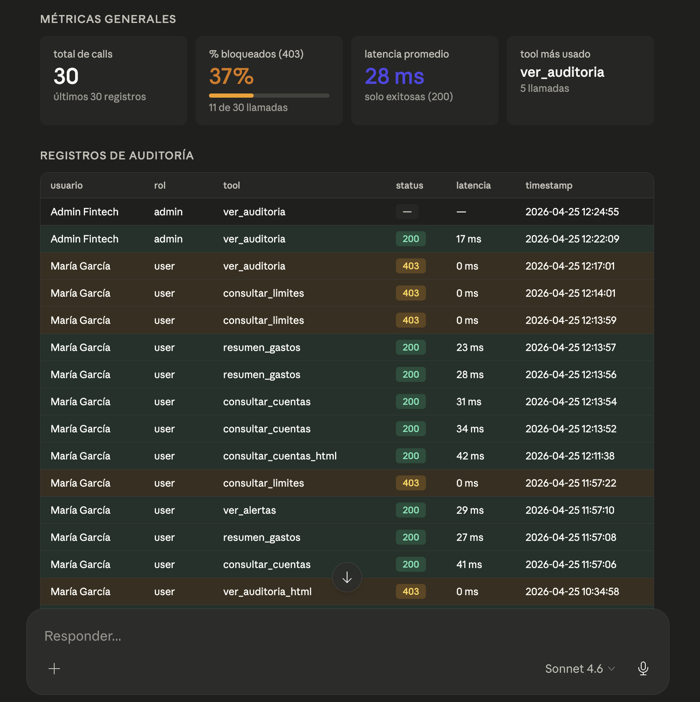


---

## 07b — Audit log HTML server-rendered (contraste con 07)

> **Rol:** admin · **Verifica:** la tool `fintech_ver_auditoria_html` retorna una tabla
> HTML coloreada por status code, generada enteramente server-side. Mismo dato que 07,
> distinta capa de presentación.

### Prompt

```
Llamá fintech_ver_auditoria_html con limite=30. Mostrame el HTML que devuelve EXACTAMENTE como vino, en un artifact tipo "text/html", sin reescribirlo. Después, en 2-3 líneas, comparalo con el post-mortem React del test anterior: ¿cuál preferirías para enviar por email a un auditor externo, y cuál para investigar interactivamente?
```

### Qué verifica

- Tabla HTML coloreada (verde 200, amarillo 403, rojo 5xx) con métricas resumen arriba.
- Claude reflexiona sobre los casos de uso de cada enfoque (estático/exportable vs interactivo).

### Evidencia

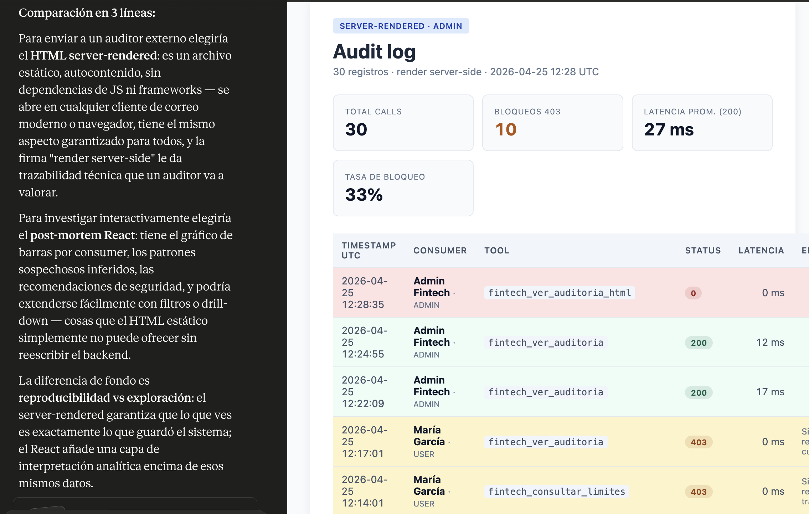


---

## 08 — Replay del audit trail (sequence diagram)

> **Rol:** admin · **Verifica:** visualización del flujo end-to-end por cada llamada.

### Prompt

```
Llamá fintech_ver_auditoria con limite=8.

Dibujame un sequence diagram Mermaid (sequenceDiagram) cronológico (de más viejo a más reciente):

Participantes:
- Consumer (el nombre del consumer)
- MCP (mcp-fintech)
- API (api-fintech)
- DB (postgres)

Para cada llamada del audit log:
- Flecha Consumer ->> MCP: <tool_nombre>
- Si es lectura, agregar MCP ->> API: HTTP GET ... y API ->> DB: SELECT
- Nota lateral con Note right of MCP: <status_code> · <latencia_ms>ms
- Si status_code = 403 → flecha discontinua roja MCP --x Consumer: 403 BLOQUEADO con nota mostrando error_msg

Después del diagrama, una breve narrativa cronológica explicando qué pasó y resaltando
bloqueos o latencias inusuales.
```

### Qué verifica

- Sequence diagram Mermaid con 4 participantes: Consumer, MCP, API, DB.
- Cada llamada del audit log → flecha + nota con tool, status_code, latencia.
- Las llamadas con 403 marcadas con flecha discontinua roja `--x`.
- Narrativa cronológica acompañando el diagrama.

### Evidencia

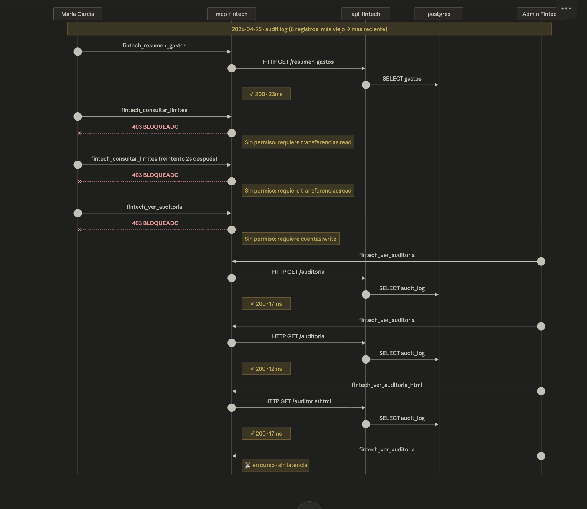


---

## 09 — Análisis libre encadenando todo (admin)

> **Rol:** admin · **Verifica:** capacidad de orquestación amplia (9-12 tools en una respuesta).

### Prompt

```
Hacé un análisis ejecutivo completo del estado de los 3 clientes:
- cliente-001, cliente-002, cliente-003

Por cada uno, reportá:
- Saldos totales (suma de cuentas)
- Exposición de gasto del mes
- Cantidad de transferencias
- Si tiene alertas de presupuesto

Después construí un artifact React con cards comparativos
y un ranking de "salud financiera" con justificación.
```

### Qué verifica

- Claude paraleliza/encadena 9-12 tool calls (3 clientes × 3-4 tools cada uno).
- El artifact integra los datos en una vista comparativa.
- Maneja errores parciales si algún cliente devuelve `NotFound`.

### Evidencia

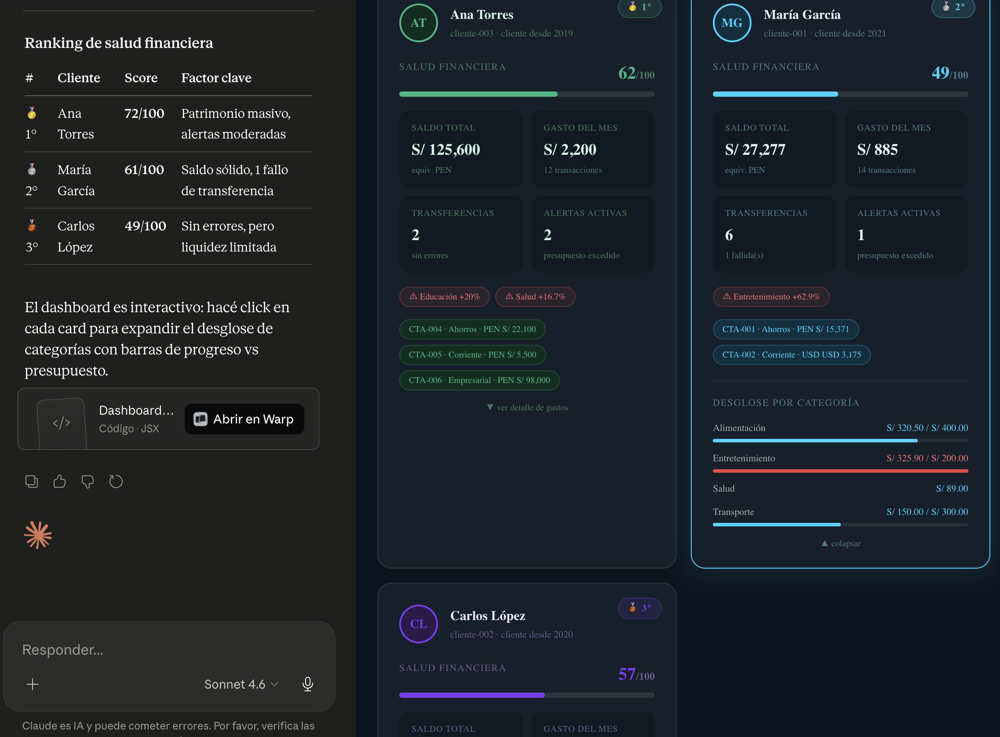

---

## Verificación cruzada en BD

Después de correr todos los tests, ejecutá:

```bash
make audit-log
```

Deberías ver decenas de registros de la sesión. Confirma que la BD refleja **exactamente**
lo que Claude reportó (mismo conteo de calls, mismas latencias, mismos 403). Esa
correspondencia 1:1 es la prueba de que el demo cumple su contrato:

> Cada llamada que el LLM dice haber hecho → existe en `audit_log` con su trazabilidad completa.

---

## Resumen de la sesión

_(Una vez completados los tests, llená esto)_

- **Fecha de la sesión:** _____
- **Versión de Claude Desktop:** _____
- **Total de tools invocadas durante la sesión:** _____ (sacalo de `make audit-log | wc -l`)
- **Bloqueos 403 registrados:** _____
- **Tests con observaciones notables:** _____
- **¿Algún prompt no cargó correctamente?:** _____
